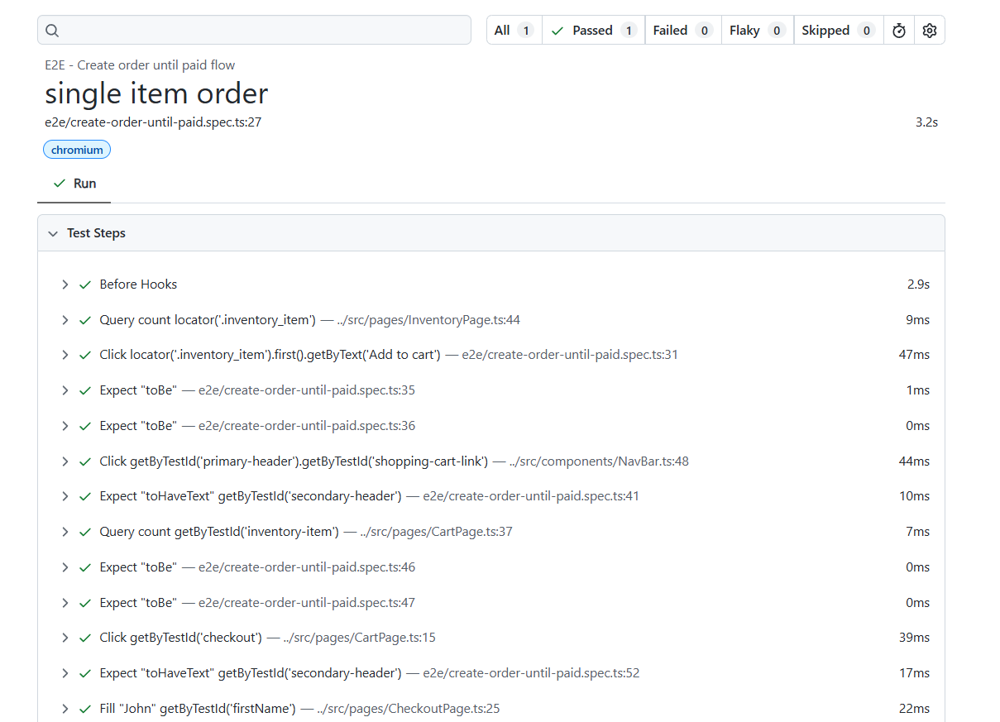
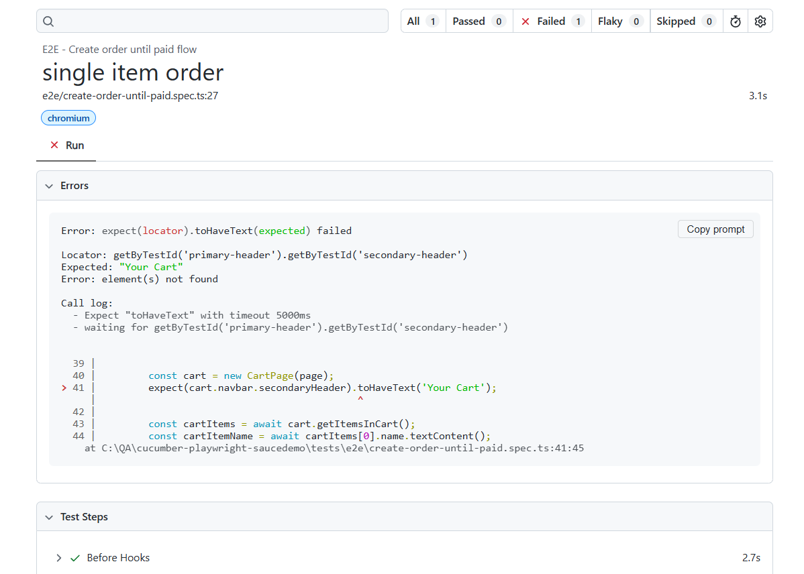

# Playwright E2E Automation Framework for SauceDemo

This is an end-to-end automation project specifically made for saucedemo.com using Playwright, built-in HTML Report, and Typescript. Github actions configuration included for CI implementation.

### Creator's Notes
- Assertions are implemented in **test files only**, page-object focus more on interactions.
- Github actions is set to run with every pull request against branch **/master**
- In case of failures, this project is configured to rerun failed case.
- Locators prioritized:
    - getByTestId (custom testIdAttribute: data-test)
    - getByRole (i.e button)
    - xpath for more complex locator.

## Tech Stack & Pre-requisites
- Node.js (LTS recommended)
- npm (comes with Node.js)

## Setup

Please make sure you already have nodejs and npm installed in your PC. For more info about instalation: https://nodejs.org/en/download
```bash
node -v
npm -v
```

Step to install Playwright + required browsers.

```bash
npm install
npx playwright install --with-deps
```

## Running the Test

By default, this project will execute all specs under *tests/* folder. 

### Run test (headless)
```bash
npx playwright test
```

### Run test with visible browser
```bash
npx playwright test --headed
```

### Run test with custom reporter (i.e HTML, List)
For more information about Playwright reporter: https://playwright.dev/docs/test-reporters
```bash
npx playwright test --reporter=html
```
### Run test with single worker
```bash
npx playwright test --workers=1
```

### Run test with environment set single worker
```bash
Windows/CMD: set ENV=qa && npx playwright test
Linux/MacOS: ENV=prod && npx playwright test
```

## Test Report

This project is using Playwright built-in HTML report. After execution, reports will be generated under *test-report/*. 
Execution artifacts such as screenshots and videos will be stored under: *test-results/*.

To open latest HTML report:
```bash
npx playwright show-report test-report
```

The HTML Reports will provide:
- Execution summary
- Readable test name
- Screenshots on failure (configurable)
- Videos after execution (configurable)
- Trace viewer for debugging.

### Sample Report and Test Results
Sample screenshot of report page,


and sample of failed execution reports

